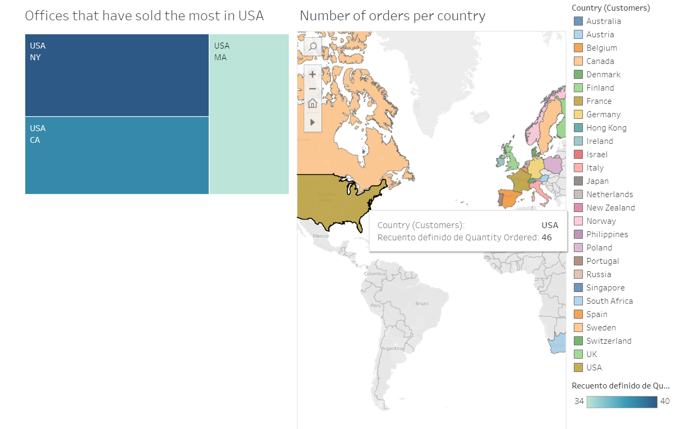

# Lab Tableau II | Marco Ayora Arsic

## Introduction

In this lab through Tableau we have processed a database about a maquette multinational company. After realising all the connections. And analysing what kind of data it had to offer i wanted to see where could be bonuses for good sales go as well as know which products are the ones that are selling the most.

## Where does the company sell the most

In our first dashboard there is the map where we can see which countries have ordered the most. This gives us an idea of where we can find our best customers. After finding that it was USA i decided to look into  which offices there are. There are three offices 1 in thre different states. Meaning that to achieve the amount of sales in such a large country and market we needed 3 offices, that are the leading offices in sales of the company.

## Who and what sells the most 

In order to find out which of the employees was being more efective in terms of sales and to see if he was located in any of the offices in USA i looked for the name of the employee the amount of sales and where do they work from. In this graph we find out that Leslie from San Francisco (USA) is indeed the top employee with most sales.  In the second graph i am now looking for what series of maquettes are the ones that sell the most. To see if any changes ocurres with divided the data by the three years we have provided in the data set 2003, 2004 and 2005. As it is clearly visible in this three years classis cars was the leading line product. In case there were any outliers i wanted to see more specificly which products exactly were the most sold. As seen in the bubbled graph we can observe the name of the product as well as the price that costs each unit. As the biggest bubble is the 1992 Ferrari 360 Spider Red meaning is the most sold but not the most expensive, that would be the darkest one which is the 1952 Alpine Renault 1300.

## Conclusion

Thanks to the visualisation we find that there is great work done in the USA market as well as the work done by the San Francisco employee who should maybe receive a raise. Therefore we can see which countries are having problem in the sales and what can we do to make the situation similar to the USA market. We also find out which is our key product as well as the most expensive one and which line products renforce do tu low revenue (trains). An extra that would be interesting to see would be the correlation between the prices and the amount sold of a product.

link to the tableau : https://public.tableau.com/app/profile/marco.ayora/viz/Marcolab2/Marcoresearch?publish=yes